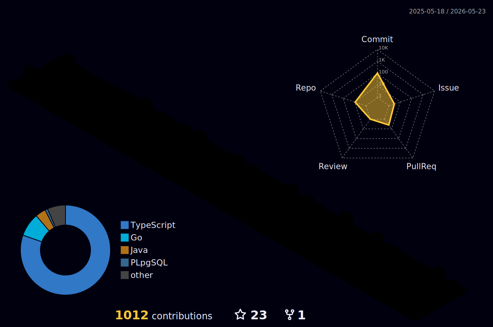

## Hi, I'm Ícaro Cedraz 👋

**Backend Developer** focused on distributed systems, financial APIs, and scalable SaaS architectures.  
Currently pursuing a Bachelor's in Computer Engineering at UFBA.

- 🏦 Recently at **Wisiex (Banco Azify)** — banking card domain APIs (authorization, billing, credit limits)
- ☁️ Self-hosted Kubernetes infrastructure with full observability stack (Grafana, Prometheus, Loki)
- 🌐 C1 Advanced English
- ✉️ icarocedraz7@gmail.com · [LinkedIn](https://linkedin.com/in/cedraz) · [Portfolio](https://portfolio.cedraz.dev/en)

<!-- 

  

 -->

---

## 🛠 Tech Stack

**Languages**  

**Frameworks & ORMs**  

**Databases & Messaging**  

**Cloud, DevOps & Observability**  
  
`OpenTelemetry` · `Loki` · `BullMQ` · `Stripe`

**Testing**  
  
`Supertest`

---

## 💼 Professional Experience

 

**Backend Developer**  
**Wisiex (Banco Azify)** · Sep 2025 – May 2026  
Critical banking APIs (card authorization, billing, credit limits) · Distributed tracing with OpenTelemetry · Async processing with BullMQ · Unit & integration testing  
`TypeScript` `NestJS` `Express` `Prisma ORM` `Kysely` `MySQL` `BullMQ` `OpenTelemetry` `Docker`

  

**Backend Developer**  
**Blue** · Feb 2025 – Sep 2025  
Multitenant SaaS white-label platform · Granular RBAC authorization system · Stripe recurring payments · Async pipelines for webhooks and billing  
`NestJS` `Prisma ORM` `PostgreSQL` `Redis` `RabbitMQ` `BullMQ` `Stripe` `Docker`

  

**Junior Full Stack Developer**  
**Warlocks** · Jun 2024 – Feb 2025  
RESTful API development · Frontend dashboards with SEO optimization · Discord bot (Discord.js + Saphire.js)  
`NestJS` `Prisma ORM` `PostgreSQL` `Redis` `RabbitMQ` `React` `Next.js` `Discord.js`

  

**Backend Manager & Tech Lead**  
[**TITAN – Computer Engineering Junior Company at UFBA**](https://titanci.com.br) · Jan 2024 – Mar 2025  
Technical leadership · Code reviews · Team mentoring (OOP, REST, SOLID) · CI/CD pipelines with GitHub Actions  
`TypeScript` `Node.js` `Fastify` `Prisma` `PostgreSQL` `Docker` `Vitest` `Swagger`

 

---

## 🚀 Featured Projects

**[Own-Hosted Infrastructure](https://github.com/cedraz)**  
Personal VPS with Kubernetes orchestration, full observability (Grafana · Prometheus · Loki · Beszel), self-hosted MinIO object storage, and zero-downtime CI/CD via GitHub Actions.  
`Kubernetes` `Docker` `Grafana` `Prometheus` `Loki` `MinIO` `GitHub Actions`

**Memiore** — Restaurant social network backend  
REST API with Redis feed caching and async notifications via BullMQ.  
`NestJS` `Prisma ORM` `PostgreSQL` `Redis` `BullMQ` `Docker`

**Event Discovery Platform** — Backend for iOS/Android mobile app  
Location-based event filtering + Python/Selenium scraper for multi-source data collection.  
`NestJS` `PostgreSQL` `MongoDB` `RabbitMQ` `Redis` `Python` `Selenium`

---

## 📖 Currently Studying

