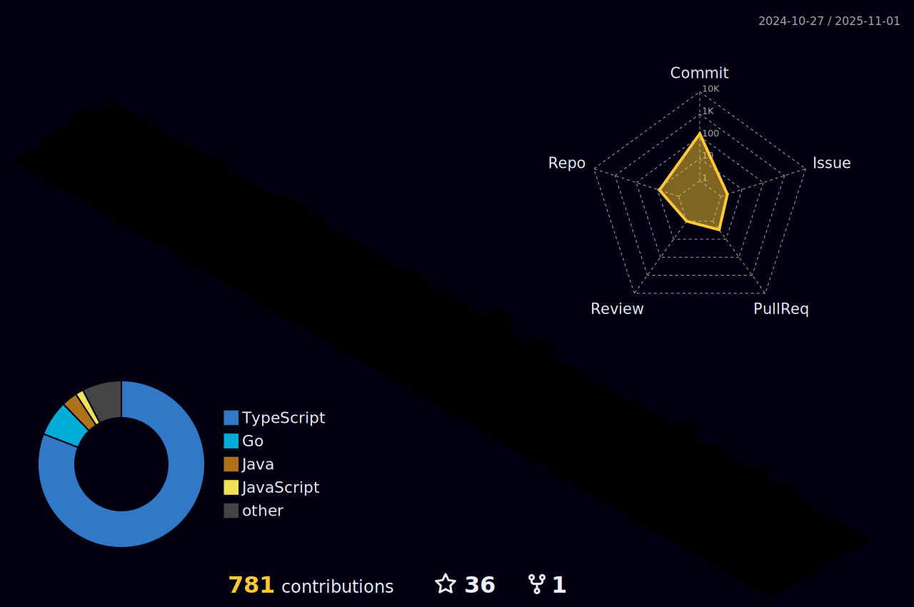

## Hi, I'm Ícaro Cedraz 👋

- 💻 Mid Level Backend Developer  
- 👨‍🎓 Bachelor's Degree Candidate in Computer Engineering at UFBA  
- ✉️ Email: icarocedraz7@gmail.com or icaro.cedraz@ufba.br  
- 🔗 Check out my portfolio: https://portfolio.cedraz.dev/en

  

## Languages I use:

## Frameworks and tools I use:

## Studying:

## Professional Experience:

 

**Backend Developer**  
**Azify**  
Sep 2025 – Present  
Languages & Technologies: `Nest.js`, `Prisma ORM`, `Redis`, `Docker`, `RabbitMQ`, `BullMQ`, `RBAC`, `Jira`, `Fastify`, `Express`, `Baton`, `MySQL`

 

**Mid-Level Backend Developer**  
**Blue Saúde**  
Feb 2025 – Oct 2025  
Languages & Technologies: `Nest.js`, `Prisma ORM`, `PostgreSQL`, `Redis`, `Docker Swarm`, `RabbitMQ`, `BullMQ`, `Stripe`, `RBAC`, `Monday.com`

 

  
**FullStack Developer**  
**Warlocks**  
Jun 2024 – Feb 2025  
Languages & Technologies: `Nest.js`, `Prisma ORM`, `PostgreSQL`, `Redis`, `Docker`, `RabbitMQ`, `Discord.js`, `Saphire.js`, `React`, `Next.js`, `Tailwind CSS`, `Linear.app`, `SEO`

  
**Software Developer**  
[**TITAN - Computer Engineering Junior Company at UFBA**](https://titanci.com.br)  
Sep 2023 – Jan 2026  
Languages & Technologies: `JavaScript`, `Next.js`, `TypeScript`, `Node.js`, `Prisma`, `Strapi`, `PostgreSQL`, `Zod`
